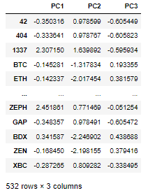
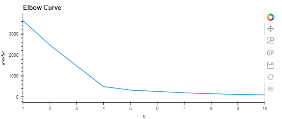
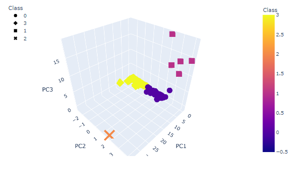
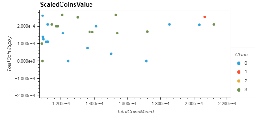

# CryptoCurrencies

## Purpose
The purpose of the project was to provide research to new customers who are interested in trading cryptocurrencies. 

# Analysis
We were provided data describing the name of each coin, the algorithm it uses, whether or not it is trading, its proof type, the nuber of coins mined for a particular coin, and the total supply of coins for each coin. 

We filtered the data to remove any coins that are not currently tading and removed any null values from the set. For clustering purposes, the names of each coin were moved to their own dataframe. To optimize the data for machine learning, we generated a system of categorical variables for columns that were not numerical in nature. 

Our analysis will see to classify the coins into distinct classes based on their respective qualities contained in the underlying data. To this end, principal component analysis (PCA) was employed to reduce the number of dimensions in the data. Prior to this process, we utilized a scalar to transform the data for this purpose. The resulting dataframe can be seen below:

For our classification analysis, we decided to use the K-Means algorithm to classify the currencies into classes. We next examined inertia by creating  an elbow curve to determine the optimal number of classes to employ in the model. 

A model was generated and fit to the underlying data to produce predictions of each of the 4 classification classes which were then added to the primary data frame. the results of this analysis can be seen below:

Scaled values of the coins were also plotted using total coins mined and total coin supply as the dimensions

